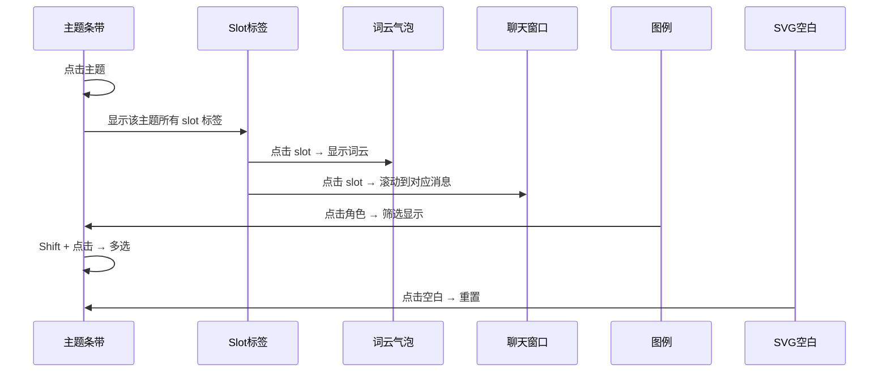

# TalkTrace — 长对话分析与可视化系统 · PRD

## 1. 项目概述

### 1.1 项目名称
**TalkTrace**（原项目名：LLM-long-conversation）

### 1.2 项目定位
一套完整的长对话分析与可视化系统。用户导入多轮对话文本后，系统通过 LLM 自动抽取语义主题（Topic）、边界检测、问题解决判定、关键词提取，最终以**胶囊条带图（Capsule Strip Graph）**和**流式图（StreamGraph）**两种可视化方式呈现对话结构，支持交互式探索。

### 1.3 核心能力
- **主题抽取**：基于 LLM 的对话主题自动识别与聚类
- **信息量评分**：基于 embedding 语义熵或 LLM 打分，量化每轮对话的"信息量"
- **问题解决判定**：判断对话中的问题是否被后续对话解决
- **词云抽取**：每个主题段落的关键词提取
- **胶囊条带图**：以纵向条带（Band）展示主题随时间演变的密度与宽度
- **流式图**：以横向 StreamGraph 展示主题分布
- **交互联动**：点击主题可高亮、多选、查看关联发言、查看词云
- **角色追踪**：按发言人连线，展示各角色在对话中的参与轨迹
- **增量对话**：支持前端继续对话，新消息实时抽取主题并合并

### 1.4 适用场景
- 会议/访谈录音转写后的语义结构分析
- 心理咨询对话的主题追踪
- 综艺节目对话的话题演变分析
- 客服对话的语义结构化

---

## 2. 系统架构

### 2.1 整体架构图

```
┌─────────────────────────────────────────────────────┐
│                    前端 (Vue 3)                       │
│  ┌──────────────┐  ┌──────────────────────────────┐  │
│  │  DialogBox    │  │  CapsuleUI / StreamGraph      │  │
│  │  (聊天界面)    │  │  (D3.js 可视化)                │  │
│  └──────┬───────┘  └──────────────┬───────────────┘  │
│         │                          │                  │
│         │     Pinia Store          │                  │
│         │ (FileInfo: 选中slot联动) │                  │
│         └──────────┬───────────────┘                  │
└────────────────────┼──────────────────────────────────┘
                     │ HTTP (axios / fetch)
┌────────────────────┼──────────────────────────────────┐
│            Flask Backend (Python)                      │
│  ┌──────────────────────────────────────────────────┐  │
│  │  /back_message → 聊天回复 + Memory               │  │
│  │  /extract      → 主题抽取 + 颜色分配              │  │
│  └────────────────────┬─────────────────────────────┘  │
│                       │                                │
│  ┌──────────────────────────────────────────────────┐  │
│  │             LLM Pipeline                          │  │
│  │  Topic_Edge_detection → Topic_merge →             │  │
│  │  refine_slot_resolution → extract_wordcloud      │  │
│  │  → assign_colors → segment_by_timeline           │  │
│  └──────────────────────────────────────────────────┘  │
│                       │                                │
│  ┌──────────────────────────────────────────────────┐  │
│  │   OpenAI API / FAISS / SentenceTransformer        │  │
│  └──────────────────────────────────────────────────┘  │
└─────────────────────────────────────────────────────────┘
```

### 2.2 技术栈

| 层级 | 技术 | 用途 |
|------|------|------|
| 前端框架 | Vue 3 + TypeScript | UI 组件 |
| 状态管理 | Pinia | Store 管理 |
| 可视化 | D3.js (v7) | SVG 绘图、布局、交互 |
| UI 组件库 | Element Plus | UI 基础组件 |
| Markdown | markdown-it | 聊天 Markdown 渲染 |
| HTTP 请求 | Axios | 前后端通信 |
| 构建工具 | Vite 6 | 前端构建 |
| 后端框架 | Flask + CORS | API 服务 |
| LLM API | OpenAI API (gpt-5.2) | 语义分析 |
| Embedding | text-embedding-3-large / bge-small-zh | 向量化 |
| 向量检索 | FAISS | 语义检索 |
| 离线评分 | SentenceTransformer | 信息量评分 |

---

## 3. 后端设计与实现

### 3.1 系统流程图

```
原始对话文本 (.txt)
    │
    ▼
┌─────────────────────────────────────────┐
│ Step 0: Topic Edge Detection            │
│ Topic_Edge_detection()                  │
│ 基于 LLM 对对话分段，标注 slot 边界      │
│ 输出: [{start_id, end_id, slot, ...}]   │
└──────────────────┬──────────────────────┘
                   ▼
┌─────────────────────────────────────────┐
│ Step 1: Topic Merge                     │
│ Topic_merge()                           │
│ LLM 聚类 slot 为更高层 topic            │
│ 输出: [{topic, slots: [...]}, ...]      │
└──────────────────┬──────────────────────┘
                   ▼
┌─────────────────────────────────────────┐
│ Step 2: Refine Resolution               │
│ refine_slot_resolution()                │
│ 判断每个 is_question slot 是否被解决    │
│ 输出: 增加 resolved 字段                │
└──────────────────┬──────────────────────┘
                   ▼
┌─────────────────────────────────────────┐
│ Step 3: Extract Wordcloud               │
│ extract_wordcloud()                     │
│ 为每个 slot 用 LLM 抽取关键词 + 权重    │
│ 输出: 增加 wordcloud 字段               │
└──────────────────┬──────────────────────┘
                   ▼
┌─────────────────────────────────────────┐
│ Step 4: Assign Colors + Segment         │
│ assign_colors() + segment_by_timeline() │
│ 分配颜色，按时间轴切段                  │
│ 输出: final JSON → 前端                 │
└─────────────────────────────────────────┘
```

### 3.2 API 接口

#### 3.2.1 `POST /back_message` — 聊天回复
- **功能**：接收用户消息，调用 LLM 生成回复，带 Memory 与 RAG
- **输入**：`{message: {id, text, from}, history: [...]}`
- **输出**：LLM 文本回复
- **关键逻辑**：
  - 基于 FAISS 检索历史相关 Memory
  - 通过 LLM 提取用户信息存入 Memory
  - 支持长对话记忆

#### 3.2.2 `POST /extract` — 主题抽取
- **功能**：对对话内容执行完整 pipeline
- **输入**：`{content: [...], reset: bool, history: [...]}`
- **输出**：带颜色、主题分段的 JSON 数组
- **关键逻辑**：
  - 调用 `pipeline_on_messages()` 执行完整抽取流程
  - 支持增量合并（`merge_topics_timeline`）
  - 相同 topic 相邻时合并 slots

### 3.3 LLM Pipeline 详解

#### 3.3.1 Topic Edge Detection（[LLM_Extraction.py:260](py/LLM_Extraction.py#L260)）
- **作用**：将对话切分为连续的语义段落（slot）
- **方法**：向 LLM 提交完整对话文本，要求返回 `[{start_id, end_id, slot, is_question, source, sentence}]`
- **约束**：段与段首尾相接，覆盖全部消息；段太短合并、太长拆分
- **后处理**：`dedup_slots_keep_first()` 去重，同名 slot 只保留第一次出现

#### 3.3.2 Topic Merge（[LLM_Extraction.py:355](py/LLM_Extraction.py#L355)）
- **作用**：将细粒度的 slot 聚类为高层 topic
- **方法**：LLM 聚类，要求 topic 名称 2~8 字中文，单一主题
- **后处理**：校验每个 slot 只出现一次，遗漏的归入"其他"

#### 3.3.3 Resolution Refinement（[LLM_Extraction.py:506](py/LLM_Extraction.py#L506)）
- **作用**：判断每个 is_question=true 的 slot 是否在后续对话中被解决
- **方法**：取 slot 段 + 后续对话，LLM 判断是否 resolved
- **输出**：`{resolved: bool, confidence: float}`

#### 3.3.4 Wordcloud Extraction（[LLM_Extraction.py:649](py/LLM_Extraction.py#L649)）
- **作用**：对每个 slot 抽取关键词云
- **方法**：取 slot 段对话文本，LLM 抽取 ≤30 个关键词，每个带权重

### 3.4 信息量评分（双方案）

#### 方案 A：Embedding 语义熵法（[Top_2_embedding.py](py/Top_2_embedding.py)）
- 用 SentenceTransformer 将每句对话编码为向量
- 计算每句与各主题向量的余弦相似度
- 用 Softmax + 熵值衡量"信息量"：熵越低 → 该句主题越明确 → 信息量越高
- 最终将熵值 reverse min-max 映射到 [0.2, 1.0]

#### 方案 B：LLM 直接打分（[LLM_Extraction.py:131](py/LLM_Extraction.py#L131)）
- `Score_turn_importance()` 调用 LLM 对每轮对话打分
- 输入完整对话，输出每个 id 的 info_score

### 3.5 Memory 系统
- 基于 `user_memory_db` 字典存储
- LLM 自动从用户输入中抽取关键信息（姓名、兴趣、偏好）
- 支持 FAISS 向量检索增强

---

## 4. 前端设计与实现

### 4.1 页面布局

```
┌─────────────────────────────────────────────────────┐
│  ┌──────────── 50% ────────┐ ┌─────── 50% ────────┐ │
│  │    DialogBox              │  │  CapsuleUI /       │ │
│  │    (聊天窗口)              │  │  StreamGraph        │ │
│  │                           │  │  (可视化画布)        │ │
│  │    [消息气泡]              │  │                     │ │
│  │    [输入框]                │  │  [胶囊条带/流式图]   │ │
│  └───────────────────────────┘ └────────────────────┘ │
└─────────────────────────────────────────────────────┘
```

### 4.2 路由与组件结构

```
App.vue
└── UI.vue                    # 主布局：左右分栏
    ├── DialogBox.vue          # 左半：聊天窗口
    │   ├── 消息气泡渲染 (Markdown)
    │   ├── 输入框 + 发送
    │   └── 与可视化联动 (点击 slot → 滚动到对应消息)
    │
    └── CapsuleUI.vue          # 右半：胶囊条带图（主可视化）
    │   ├── D3.js SVG 画布
    │   ├── topic-band 图层    # 主题条带
    │   ├── slot-label 图层    # slot 标签云
    │   ├── speaker-line 图层  # 发言人全局连线
    │   ├── wordcloud-bubble   # 词云气泡
    │   ├── 主题图例           # 点击高亮/多选
    │   └── 角色图例           # 点击筛选发言人
    │
    └── StreamGraph.vue        # 流式图（备选可视化）
        ├── D3.js stack/area
        ├── 90° 旋转布局
        └── 主题图例
```

### 4.3 数据模型

#### Conversation（对话主题）
```
{
  topic: string          // 主题名称
  slots: Slot[]          // 该主题下的 slot 列表
  color: string          // 主题颜色
}
```

#### Slot（语义段落）
```
{
  id: number            // turn ID（对话轮次编号）
  slot: string          // slot 名称（细粒度主题）
  sentence: string      // 代表句
  source: string        // 发言人
  color: string         // slot 颜色（主题颜色的浅色变体）
  is_question: boolean  // 是否为问题
  resolved: boolean     // 问题是否被解决
  start_id/end_id: number  // 在对话中的起止 id
  wordcloud: [{word, weight}]  // 词云
}
```

#### Point（可视化坐标点）
```
{
  topic: string, topicColor: string,
  id: number, source: string,
  slot: string, sentence: string,
  is_question, resolved,
  info_score: number,     // 信息量评分
  wordcloud: [...]        // 词云
}
```

### 4.4 状态管理（[Pinia Store](src/stores/FileInfo.ts)）

```
useFileStore:
  - MessageContent: MessageItem[]    // 历史对话内容
  - GPTContent: Conversation[]       // GPT 生成的对话
  - selectedSlotId: number | null    // 选中的 slot id（左右联动）
  - refreshKey: number               // 控制左侧刷新
```

### 4.5 可视化核心算法

#### 4.5.1 数据预处理流程（[CapsuleUI.vue:1253](src/components/CapsuleUI.vue#L1253) drawUI）

```
原始 JSON 数据
    │
    ▼
1. extractPointsAndTopics()     → 抽点 + 主题列表 + 颜色映射
2. assignSpeakerColors()        → 分配发言人颜色
3. computeXs()                  → 计算时间轴范围
4. computeTopicKDE()            → 每个主题的 KDE 密度曲线
5. buildRowProfile()            → 每行条带总宽度（基于 info_score）
6. computeWidthByTopicById()    → 每个主题在每行的宽度分配
7. solveBandsAndSlotsRowWise()  → 协同优化条带排列 + 点位置
8. renderTopicBands()           → 绘制条带
9. drawGlobalSpeakerLines()     → 绘制发言人轨迹线
10. drawLegends()               → 绘制图例
11. setupZoom()                 → 缩放交互
```

#### 4.5.2 条带宽度算法（[Methods.ts:705](src/utils/Methods.ts#L705) buildRowProfile）

```
每个 turn 的总条带宽度 = stripWidthFixed × factor

factor 的计算：
1. 将时间轴分为 numBlocks 块
2. 每块内取所有 turn 的 info_score 平均值
3. 将块平均值做 gamma 非线性映射到 [minF, maxF]
4. 块内用 smoothstep 插值平滑过渡

结果：信息量高的对话段落 → 条带更宽
```

#### 4.5.3 主题内宽度分配（[Methods.ts:919](src/utils/Methods.ts#L919) computeWidthByTopicById）

```
1. 取当前 turn 所有主题的 KDE 密度值
2. 过滤低密度尾巴（< maxD × relDensTh）
3. 对密度做 alpha 幂次加权（alpha=2）
4. 归一化后乘以该 turn 总宽度
5. 二次过滤：宽度 < minWidthPx 或比例 < minRatio 的置零
```

#### 4.5.4 协同布局优化（[Methods.ts:100](src/utils/Methods.ts#L100) solveBandsAndSlotsRowWise）

核心思路：对每行（每个 turn），把多个 topic 排列进条带，优化三个目标：

- **A（最大化重叠度）**：同一 topic 在相邻行的条带位置尽量重叠，减少视觉跳跃
- **B（最小化发言位移）**：每个发言人在时间轴上的位置变化尽量小
- **C（最小化顺序翻转）**：主题排列顺序尽量避免不必要的翻转

**求解方法**：
1. 对每行，筛选本行出现的 topic
2. 生成候选排列（新 topic 固定位置，仅排列旧 topic）
3. 对每个排列 + 偏移量，计算 score = A - β×B - γ×C
4. 选择 score 最高的排列

**双方案对比**：
- **Baseline**（固定顺序）：所有行同一顺序，不考虑连续性
- **Greedy**（贪心优化）：逐行搜索最优排列

#### 4.5.5 发言人轨迹线（[CapsuleUI.vue:408](src/components/CapsuleUI.vue#L408) drawGlobalSpeakerLines）

- 将每个发言人的所有发言点按时间顺序连线
- 使用 `curveMonotoneY` 平滑曲线
- 支持点击角色图例筛选特定发言人

#### 4.5.6 词云气泡（[CapsuleUI.vue:733](src/components/CapsuleUI.vue#L733) tryRenderWordcloudInBandbubble）

- 点击 slot 标签 → 在条带旁弹出词云气泡
- 使用螺旋搜索 + 碰撞检测放置词语
- 词大小映射权重，透明度映射权重
- 带箭头的气泡指向点击点
- 缩放 ≥ 阈值时显示

#### 4.5.7 StreamGraph（[StreamGraph.vue](src/components/StreamGraph.vue)）

- 使用 D3.js `d3.stack().offset(d3.stackOffsetWiggle)` 生成流式图
- 90° 旋转（水平时间轴）
- KDE 密度 × rowWeight 作为层高度
- 点击层 → 切换高亮 → 显示对应 slot 标签

### 4.6 交互联动机制



### 4.7 聊天对话模块（[DialogBox.vue](src/components/DialogBox.vue)）

- 支持 Markdown 渲染
- 消息先右（自己）/ 左（他人）的 IM 风格
- 自动从数据集中解析原始对话文本（支持两种格式：`meeting_talk.txt` 和 `xinli_talk.md`）
- 支持"新开分支"：选中 topic 后，将关联消息作为历史启动新对话
- 通过 `axios` 将消息发送到 Flask 后端

---

## 5. 数据文件与格式

### 5.1 数据集

| 数据集 | 类型 | 文件前缀 | 说明 |
|--------|------|----------|------|
| meeting | 会议/综艺对话 | `meeting_*` | 《非正式会谈》综艺节目 |
| xinli | 心理咨询对话 | `xinli_*` | AI 心理咨询模拟对话 |

### 5.2 文件清单

| 文件 | 用途 |
|------|------|
| `*_result.json` | 最终处理结果（主题分段的对话结构） |
| `*_info_with_scores.json` | 每轮对话的信息量评分 |
| `*_talk.txt` / `*_talk.md` | 原始对话文本 |
| `*_talk_scores.json` | 对话文本评分结果 |
| `*_score.json` | 主题段评分 |

---

## 6. 关键设计决策

### 6.1 为什么用 LLM 而非传统 NLP？

传统主题模型（LDA 等）对短文本、口语化对话效果差，且无法理解上下文语义。LLM 能捕捉：
- 话题间的语义相似性
- 问题是否被解决（需要理解后续对话）
- 中文口语中模糊的主题边界

### 6.2 为什么用胶囊条带图而非 StreamGraph？

两种可视化并存，各有优势：

| 可视化 | 优势 | 劣势 |
|--------|------|------|
| 胶囊条带图 | 可展示主题内文本标签、发言人轨迹 | 宽度表现力有限 |
| StreamGraph | 密度变化直观，视觉冲击力强 | 不易展示文本信息 |

### 6.3 为什么做双方案布局？

**Baseline（固定顺序）** vs **Greedy（贪心优化）** 的对比可以让用户直观看到优化效果。Greedy 方案考虑了三项目标函数的平衡，在视觉上能显著减少主题条带的断裂和跳跃。

### 6.4 离线评分 vs 在线评分

- **Embedding 法**（`Top_2_embedding.py`）：速度快，可批量处理，适合大数据量
- **LLM 法**（`Score_turn_importance`）：质量更高，但成本高、速度慢

两者可自由切换，前端数据格式一致。

---

## 7. 部署与使用

### 7.1 启动方式

```bash
# 后端
cd py && python app.py    # Flask 运行在 :5000

# 前端
npm install && npm run dev  # Vite 运行在 :5173
```

### 7.2 数据预处理流程

```bash
cd py && python Real_Data_Generation.py
```

该脚本依次执行：
1. Step 0: Edge Detection（边界检测）
2. Step 1: Topic Merge（主题合并）
3. Step 2: Refine Resolution（问题解决判定）
4. Step 3: Extract Wordcloud（词云提取）
5. Step 4: Segment & Color（分段 + 着色）
6. Step 5: Clean Isolated Points（清理孤立点）

---

## 8. 项目文件结构

```
├── src/                          # 前端源码
│   ├── components/
│   │   ├── UI.vue                # 主布局（左右分栏）
│   │   ├── CapsuleUI.vue         # 胶囊条带图（核心可视化）
│   │   ├── DialogBox.vue         # 聊天窗口
│   │   ├── StreamGraph.vue       # 流式图
│   │   └── TestGraph.vue         # （备选/遗留）
│   ├── stores/
│   │   └── FileInfo.ts           # Pinia 状态管理
│   ├── types/
│   │   └── index.ts              # TypeScript 类型定义
│   ├── utils/
│   │   └── Methods.ts            # D3 可视化核心算法
│   ├── App.vue
│   └── main.ts
├── py/                           # 后端源码
│   ├── app.py                    # Flask API 服务
│   ├── LLM_Extraction.py         # LLM Pipeline 核心
│   ├── Methods.py                # 工具函数（颜色/合并/解析）
│   ├── Real_Data_Generation.py   # 离线数据处理脚本
│   ├── Top_2_embedding.py        # Embedding 信息量评分
│   └── conversation_example/     # 示例数据与中间结果
├── public/                       # 静态数据文件（JSON/TXT）
└── package.json                  # 前端依赖
```
